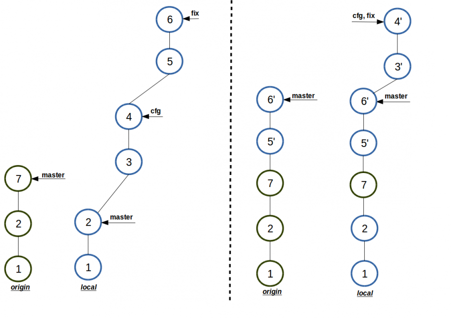

# **MasterConfigFix (MCF) - схема работы с git.** 

**Автоматизация работы с использованием нескольких локальных конфигураций. Схема работы с тремя ветками.** 

## Зачем это надо

Практически в любом проекте нужно настроить, как минимум, одну конфигурацию для разработчика, которая отличается от конфигурации заказчика. Например, это и настройки базы, и настройки хоста, и пути к библиотекам, и специфичные файлы IDE и т.п. Также это необходимо, чтобы помочь нескольким разработчикам иметь одинаковую конфигурационную среду.

Все это не сложно настроить, но сразу возникнет проблема, как отделять общий код от локальной конфигурации при каждой синхронизации с внешним хранилищем кода. И тем более не допустить ошибок и не сломать код на production.

В интернете есть много решений, очень популярная техника Git Workflow:

* [http://nvie.com/posts/a-successful-git-branching-model/](http://nvie.com/posts/a-successful-git-branching-model/)

* [https://www.atlassian.com/git/tutorials/comparing-workflows/centralized-workflow](https://www.atlassian.com/git/tutorials/comparing-workflows/centralized-workflow)

Но они либо для больших групп разработчиков, либо имеют некоторые недостатки, которые делают неудобными их применение.

Последняя версия [конфигурационного файла](https://github.com/wellic/myworkflow), который описывает данный процесс

## 3-branch workflow Master-Cfg-Fix (MCF)

Для работы c данной схемой используется 3 веточная схема: master-cfg-fix (MCF). По умолчанию ветки (бранчи), имеют названия (но можно у себя назвать как удобно, главное выдержать суть содержания:

1. master — основная общая ветка с production настройками; 
Важно помнить, что работать на это ветке нельзя, т.к. эта ветка должна точно соответствовать тому, что находится в удаленном хранилище, чтобы уменьшить исключить ряд проблем при синхронизации с локальной копией.

2. cfg — ветка локальной конфигурации, наследуется от мастер и имеет свои особенности. Ветка предназначена для настройки и внесения изменений необходимых для локальной работы разработчика (конфигурационные файлы, различные настройки и т.п.). Данная ветка тоже не используется для работы.

3. fix — ветка разработки, наследуется от cfg. В ней ведется разработка. По окончанию работ изменения, сделанные в ней, переносятся в ветку master и в удаленное хранилище с помощью команды upload.

Для синхронизации  информацией между ветками и внешним репозиторием после окончания работ на ветке fix было построено 2 команды, которые выполняют набор необходимых действий: 

1. подтянуть изменения из внешнего репозитория, т.к. во время работы могли произойти изменения, т.е. обновить ветку master;

2. перенести эти изменения на ветки cfg и fix;

3. применить изменения с ветки fix на ветку master, исключая изменения в ветке cfg;

4. отправить в репозиторий обновленную ветку master;

5. отправить в репозиторий копию ветки ветки cfg;

6. на всякий случай применить пункты 1 и 2, если за время синхронизации появились новые изменения.

Пункты 1 и 2 выполняет пользовательская команда git w-update. Эта команда синхронизирует локальные 3 ветки master-cfg-fix (MCF) с текущим состоянием во внешенм репозитории. 

Весь цикл, пункты 1-6, выполняет команда git upload.

На рисунке показан процесс синхронизации между удаленным репозиторием и локальным хранилищем до (слева) и после (справа) применения комманды w-upload.

Для упрощения на рисунке не показано, что в удаленном хранилище создается последний временная ветка с последним коммитом из локальной ветки cfg.

От сюда следует заключеник, что для работы с внешними репозиториями достаточно одной (upload), максимум двух команд (update+upload). Преимущество - вся ручная работа безошибочно выполняется в автоматическом режиме, при этом выполняется достаточно большое количество операций. Практически в 99% случаев все проходит без конфликтов, и занимает несколько секунд. Также данные команды могут использоваться и для схемы работы, когда не нужно специальное рабочее окружения. Ветка cfg создается для совместимости и не используется, и все команды используются для синхронизации как было описано выше.

### Выводы

Данная система команд позволяет с помощью предложенной схемы:

* автоматическое обновление исходников в рабочих ветках;
* автоматическое обновление исходников в удаленном хранилище;
* поддерживать линейную схему истории;
* делается бекап локального конфига на удаленный сервер;
* для одного проекта можно использовать несколько локальных конфигов окружения;
* при автоматических обновлениях все шаги документируются;
* позволяет в группе проводить единую схему работы;
* уменьшения количества ошибок за счет автоматизации процесса;
* может использоваться при работе, где не нужно специальное локальное окружение.

## Дополнение

### Исходники

[https://github.com/wellic/myworkflow](https://github.com/wellic/myworkflow)

